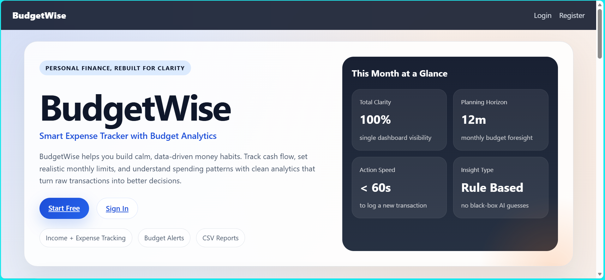
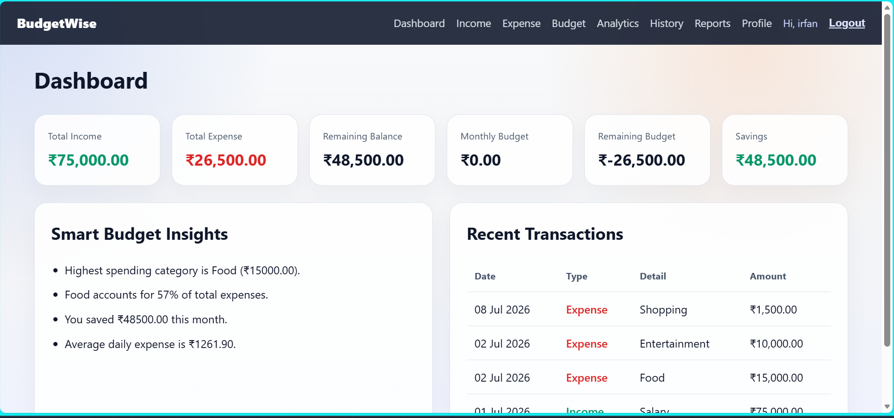
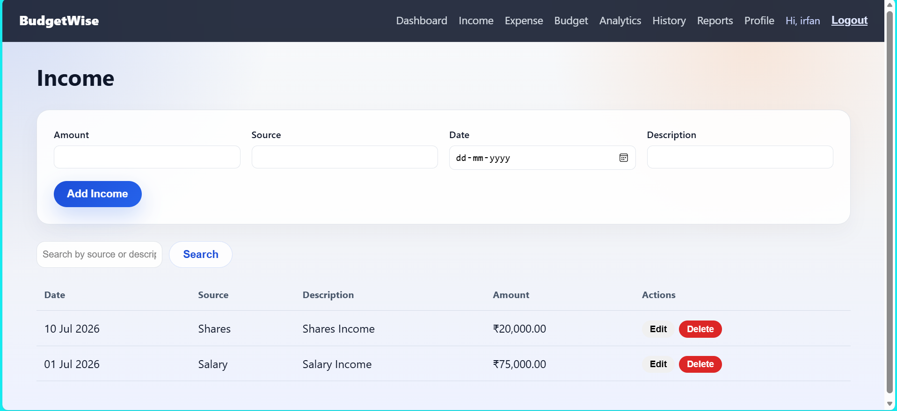
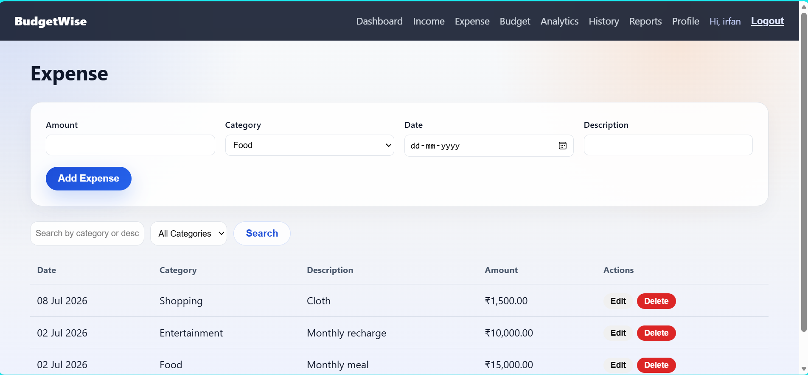
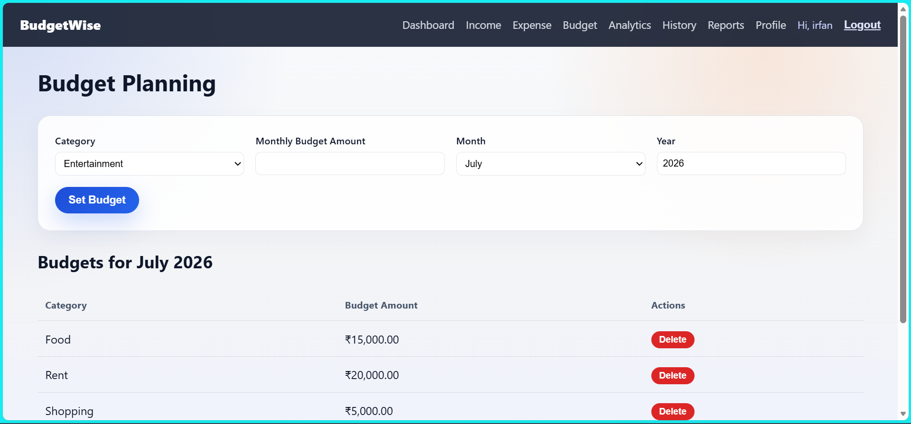
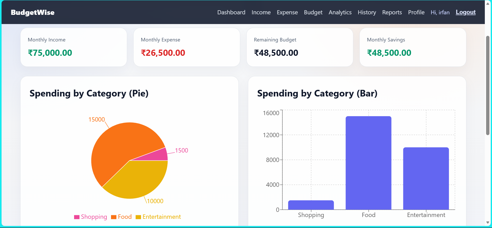
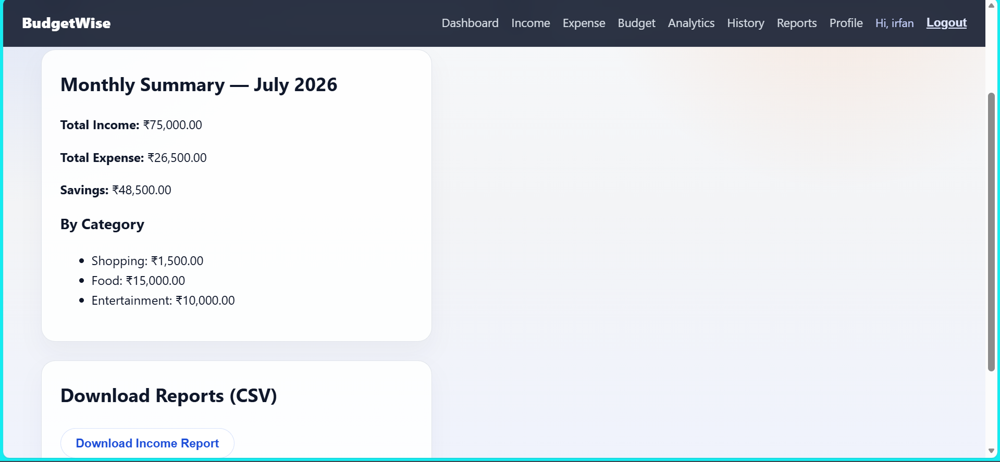

# 💰 BudgetWise

A modern full-stack personal finance management application that helps users track income and expenses, create monthly budgets, analyze spending habits, and generate financial reports.

> **Tech Stack:** React • Node.js • Express • MySQL (TiDB Cloud) • JWT • Render • Vercel

---

## 🌐 Live Demo

- **Live Application:** https://budgetwise-svxtmv4qh-irfan0781.vercel.app
- **Backend API:** https://budgetwise-api-vehr.onrender.com/api

---

## 📸 Screenshots

### Home Page



---

### 📊 Dashboard



---

### 💰 Income



---

### 💸 Expense



---

### 🎯 Budget Planner



---

### 📈 Analytics



---

### 📄 Reports



---

## ✨ Features

### 🔐 Authentication

- User Registration
- Secure Login
- JWT Authentication
- Password Hashing using bcrypt
- Protected Routes

---

### 📊 Dashboard

- Total Income
- Total Expenses
- Current Balance
- Monthly Budget
- Savings Overview
- Recent Transactions

---

### 💵 Income Management

- Add Income
- Edit Income
- Delete Income
- Search Income
- Monthly Tracking

---

### 💸 Expense Management

Track expenses across multiple categories:

- Food
- Rent
- Shopping
- Travel
- Education
- Health
- Entertainment
- Bills
- Others

Features:

- Add Expense
- Edit Expense
- Delete Expense
- Search Expenses
- Filter by Category
- Filter by Date

---

### 🎯 Budget Planning

- Monthly Budget
- Category-wise Budget
- Budget Utilization
- Budget Alerts

---

### 📈 Analytics

- Category-wise Pie Chart
- Daily Expense Trend
- Monthly Comparison
- Income vs Expense Analysis

---

### 🧠 Smart Insights

Rule-based financial analysis:

- Highest Spending Category
- Budget Exceeded Detection
- Monthly Spending Comparison
- Daily Average Spending
- Savings Summary

---

### 📄 Reports

- Monthly Summary
- CSV Export
- Transaction History
- Search & Filter

---

### 👤 Profile

- Update Name
- Change Password

---

## 🏗️ System Architecture

```
React (Vite)
      │
      ▼
Axios API
      │
      ▼
Express.js REST API
      │
      ▼
JWT Authentication
      │
      ▼
MySQL (TiDB Cloud)
```

---

## 🛠 Tech Stack

| Layer          | Technology                    |
| -------------- | ----------------------------- |
| Frontend       | React (Vite)                  |
| Routing        | React Router                  |
| HTTP Client    | Axios                         |
| Charts         | Recharts                      |
| Backend        | Node.js                       |
| Framework      | Express.js                    |
| Authentication | JWT + bcrypt                  |
| Database       | TiDB Cloud (MySQL Compatible) |
| Deployment     | Vercel + Render               |

---

## 📁 Project Structure

```
budgetwise/
│
├── client/
│   ├── src/
│   │   ├── components/
│   │   ├── context/
│   │   ├── pages/
│   │   ├── services/
│   │   └── utils/
│   ├── public/
│   └── package.json
│
├── server/
│   ├── config/
│   ├── controllers/
│   ├── database/
│   │   └── schema.sql
│   ├── middleware/
│   ├── models/
│   ├── routes/
│   └── package.json
│
├── README.md
└── .gitignore
```

---

# 🚀 Installation

## Clone Repository

```bash
git clone https://github.com/irfan-aman/budgetwise.git
cd budgetwise
```

---

## Backend Setup

```bash
cd server
npm install
cp .env.example .env
```

Update `.env`

```env
PORT=5000

DB_HOST=your_host
DB_PORT=4000
DB_USER=your_username
DB_PASSWORD=your_password
DB_NAME=budgetwise
DB_SSL=true

JWT_SECRET=your_secret
JWT_EXPIRES_IN=7d

CLIENT_URL=http://localhost:5173
```

Start backend

```bash
npm run dev
```

---

## Frontend Setup

```bash
cd client
npm install
cp .env.example .env
```

Update

```env
VITE_API_URL=http://localhost:5000/api
```

Run

```bash
npm run dev
```

---

## 📌 Environment Variables

### Backend

| Variable       | Description       |
| -------------- | ----------------- |
| PORT           | Backend Port      |
| DB_HOST        | Database Host     |
| DB_PORT        | Database Port     |
| DB_USER        | Database Username |
| DB_PASSWORD    | Database Password |
| DB_NAME        | Database Name     |
| DB_SSL         | Enable SSL        |
| JWT_SECRET     | Secret Key        |
| JWT_EXPIRES_IN | Token Expiry      |
| CLIENT_URL     | Frontend URL      |

---

## 📡 API Endpoints

### Authentication

- POST `/api/auth/register`
- POST `/api/auth/login`

### Income

- GET `/api/income`
- POST `/api/income`
- PUT `/api/income/:id`
- DELETE `/api/income/:id`

### Expenses

- GET `/api/expense`
- POST `/api/expense`
- PUT `/api/expense/:id`
- DELETE `/api/expense/:id`

### Budget

- GET `/api/budget`
- POST `/api/budget`
- PUT `/api/budget/:id`
- DELETE `/api/budget/:id`

### Dashboard

- GET `/api/dashboard`
- GET `/api/dashboard/analytics`

### Profile

- GET `/api/profile`
- PUT `/api/profile`

### Reports

- GET `/api/reports/summary`
- GET `/api/reports/income/csv`
- GET `/api/reports/expense/csv`

---

## ☁️ Deployment

### Database

- TiDB Cloud (Serverless)

### Backend

- Render

### Frontend

- Vercel

---

## 📚 What I Learned

- REST API Development
- JWT Authentication
- Password Hashing with bcrypt
- React Context API
- Express Middleware
- SQL Database Design
- Cloud Database Integration
- Backend Deployment
- Frontend Deployment

---

## 🚀 Future Improvements

- Dark Mode
- Email Notifications
- OCR Bill Scanner
- Recurring Transactions
- Mobile App
- Progressive Web App (PWA)

---

## 📄 License

This project is licensed under the MIT License.
